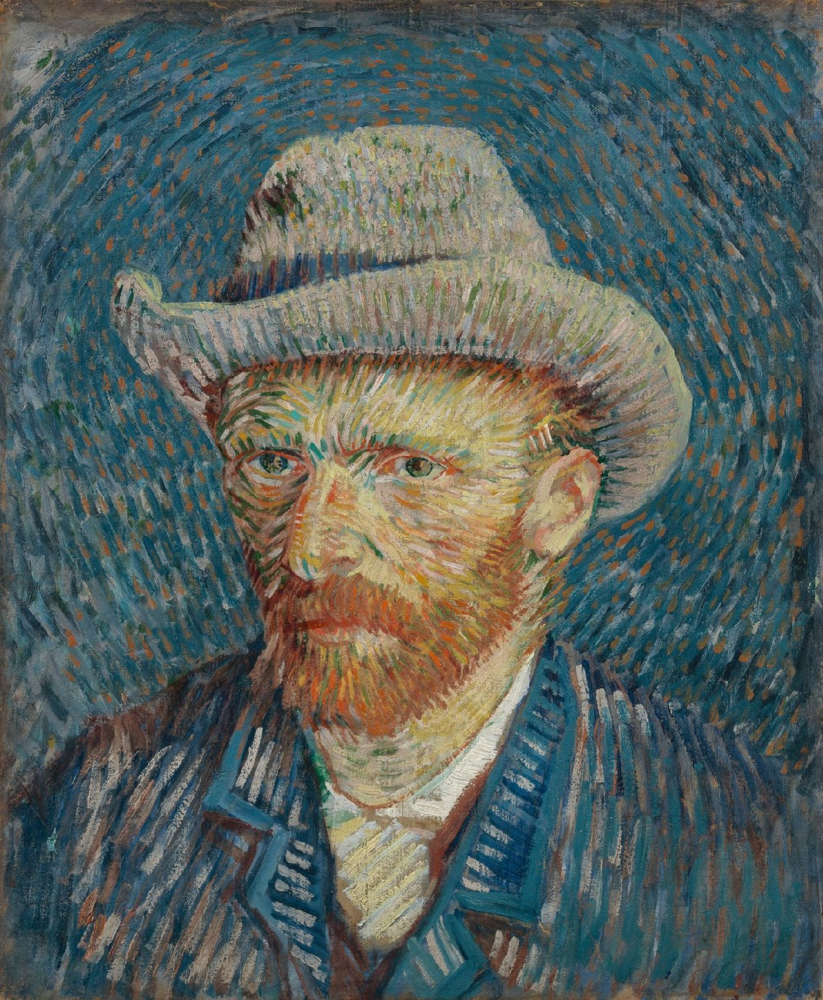
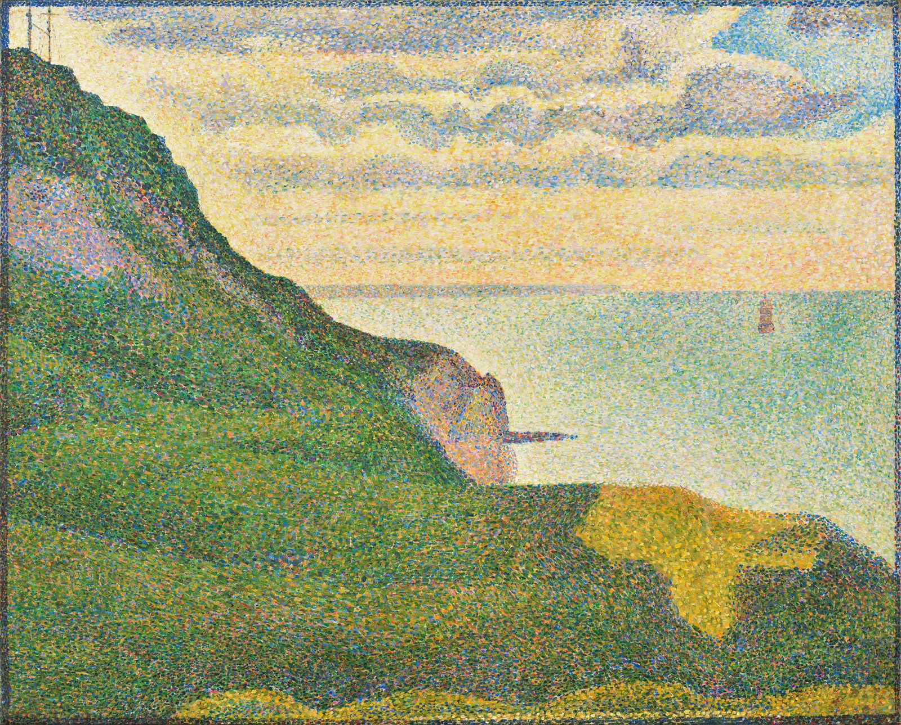

# sala3383_9103_tut4
Major Assignment 🎨 

## Imaging Technique 🖼️
 
As seen in the examples from Van Gogh and Seurat, they use a technique that have tiny points or lines to form the bigger picture. The use of short lines make it look like the artwork is flowing. This is the technique I want to use to portray Abad's 'Wheel of Fortune.' I think this technique would provide a unique twist to the artwork as the use of varying sizes of lines would allow me to add different visual effects. 

## Coding Technique👩🏽‍💻
A technique I found that could possibily help me achieve the flowing lines 

